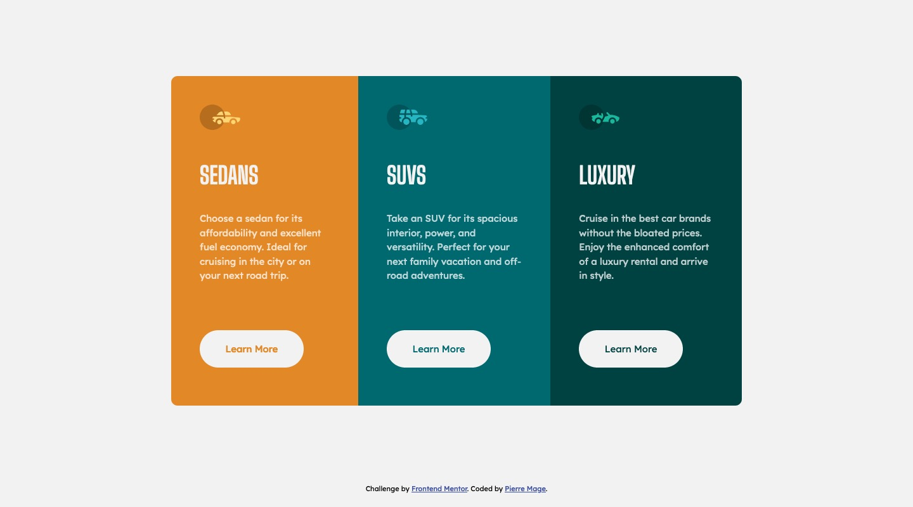

# Frontend Mentor - 3-column preview card component solution

This is a solution to the [3-column preview card component challenge on Frontend Mentor](https://www.frontendmentor.io/challenges/3column-preview-card-component-pH92eAR2-). Frontend Mentor challenges help you improve your coding skills by building realistic projects. 

## Table of contents

- [Overview](#overview)
  - [The challenge](#the-challenge)
  - [Screenshot](#screenshot)
  - [Links](#links)
- [My process](#my-process)
  - [Built with](#built-with)
  - [What I learned](#what-i-learned)

## Overview

### The challenge

Users should be able to:

- View the optimal layout depending on their device's screen size
- See hover states for interactive elements

### Screenshot

### Links

- Solution URL: https://github.com/PierreMage/PierreMage.github.io/tree/master/frontendmentor/3-column-preview-card
- Live Site URL: https://pierremage.github.io/frontendmentor/3-column-preview-card/

## My process

### Built with

- Semantic HTML5 markup
- Sass
- CSS custom properties
- Flexbox
- Mobile-first workflow

### What I learned

Space or Enter key press does not activate an HTML anchor element. See [How to trigger the :active pseudoclass on keyboard 'enter' press? (using only CSS) | StackOverflow](https://stackoverflow.com/questions/32467397/how-to-trigger-the-active-pseudoclass-on-keyboard-enter-press-using-only-cs).